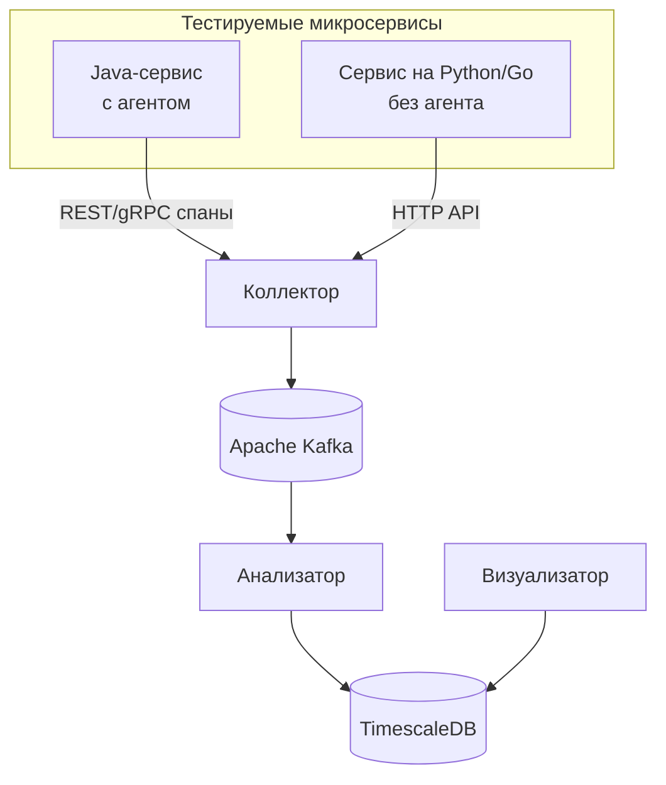

# 🔍 СинхронАналитик

### Платформа интеллектуального анализа и оптимизации синхронного взаимодействия между микросервисами

*REST · gRPC · Интегральный коэффициент · Рекомендации*

[О проекте](#-о-проекте) • [Возможности](#-ключевые-возможности) • [Архитектура](#-архитектура-обзор) • [Интегральный коэффициент](#-интегральный-коэффициент) • [Быстрый старт](#-быстрый-старт) • [Документация](#-документация) • [Лицензия](#-лицензия)

---

## 📌 О проекте

**Синхронные вызовы — основная причина задержек, каскадных сбоев и архитектурного долга в микросервисах.**  
Существующие инструменты (Prometheus, Jaeger, ELK) показывают *что* плохо, но не отвечают на вопросы *почему* и *что делать*.

**СинхронАналитик** — это платформа, которая:

- 🔌 **Подключается** к вашим микросервисам одной зависимостью (Spring Boot Starter)
- 📊 **Собирает** данные о REST и gRPC вызовах без изменения кода
- 🧠 **Анализирует** производительность и архитектурные паттерны
- 🎯 **Вычисляет** интегральный коэффициент качества взаимодействия
- 💡 **Даёт конкретные рекомендации** по оптимизации

Проект ориентирован на **этап тестирования и CI/CD**, помогая находить узкие места до попадания в production.

---

## ✨ Ключевые возможности


|     | Возможность                   | Описание                                                      |
| --- | ----------------------------- | ------------------------------------------------------------- |
| 🔌  | **Подключение за минуту**     | Spring Boot Starter — добавил зависимость и работает          |
| 🔄  | **REST + gRPC**               | Единый агент для обоих протоколов синхронного взаимодействия  |
| 🧬  | **Сквозная трассировка**      | Полная поддержка W3C TraceContext                             |
| 📈  | **Интегральный коэффициент**  | Единая метрика «здоровья» эндпоинта/сервиса                   |
| 🚨  | **Обнаружение антипаттернов** | N+1 запросы, циклы, избыточные вызовы, глубина цепочек и т.д. |
| 💬  | **Рекомендации**              | Что исправить и как — текстовые советы для разработчика       |
| 📊  | **Веб-дашборд**               | Трассы, графики, список проблем — всё в одном месте           |
| 🌐  | **Мультиязычность**           | HTTP API для отправки данных из сервисов на любых языках      |
| 🐳  | **Docker Compose**            | Весь стек поднимается одной командой                          |


---

## 🏗 Архитектура (обзор)




| Компонент        | Назначение                                     | Технологии                         |
| ---------------- | ---------------------------------------------- | ---------------------------------- |
| **Агент**        | Сбор данных в Java-микросервисах               | Spring AOP, gRPC interceptors      |
| **Коллектор**    | Приём, валидация, обогащение спанов            | Spring WebFlux, Kafka              |
| **Kafka**        | Надёжная буферизация потока                    | Apache Kafka                       |
| **Анализатор**   | Вычисление метрик, поиск проблем, рекомендации | Spring Boot Scheduler, TimescaleDB |
| **TimescaleDB**  | Хранение временных рядов                       | PostgreSQL + TimescaleDB           |
| **Визуализатор** | Веб-интерфейс                                  | Spring MVC, Thymeleaf, Chart.js    |


---

## 🎯 Интегральный коэффициент (значения будут уточнены позже)

Мы ввели единую метрику, которая сводит разнородные показатели в одно число от 0 до 1, где **0 — идеально, 1 — критично**.


| Фактор                  | Вес  | Нормировка                |
| ----------------------- | ---- | ------------------------- |
| p95 latency             | 0.35 | `min(1, latency / 500ms)` |
| Error rate (5xx)        | 0.25 | `min(1, errors / 10%)`    |
| Throughput (RPS)        | 0.10 | `min(1, rps / capacity)`  |
| N+1 запросы             | 0.15 | `1` если есть             |
| Циклические зависимости | 0.10 | `1` если есть             |
| Глубина цепочки         | 0.05 | `min(1, depth / 5)`       |


**Интерпретация:**

- 🟢 **0.00–0.20** — отлично
- 🟡 **0.21–0.40** — норма
- 🟠 **0.41–0.60** — требует внимания
- 🔴 **0.61–0.80** — плохо
- ⚫ **0.81–1.00** — критично

Коэффициент помогает быстро приоритезировать задачи, а детали всегда доступны в дашборде.

---

## 🚀 Быстрый старт (будет уточнен позже)

### 1. Запустите серверную часть

```bash
git clone https://github.com/yourname/sync-analyzer.git
cd sync-analyzer
docker-compose up -d
```

Стек поднимется за 30 секунд:

- Коллектор на `http://localhost:8081`
- Визуализатор на `http://localhost:8080`
- Kafka на `localhost:9092`
- TimescaleDB на `localhost:5432`

### 2. Подключите агент к вашему Java-микросервису

**Maven:**

```xml
<dependency>
    <groupId>io.syncanalyzer</groupId>
    <artifactId>agent-starter</artifactId>
    <version>1.0.0</version>
</dependency>
```

**Gradle:**

```groovy
implementation 'io.syncanalyzer:agent-starter:1.0.0'
```

### 3. Настройте (опционально)

```yaml
analyzer:
  agent:
    collector-endpoint: http://collector:8081/api/spans
    service-name: ${spring.application.name}
```

### 4. Запустите тесты и откройте дашборд

Перейдите на `http://localhost:8080` и увидите:

- Графики latency и ошибок
- Интегральные коэффициенты по сервисам
- Список проблем с рекомендациями

---

## 📚 Документация


| Документ                                | Содержание                                     |
| --------------------------------------- | ---------------------------------------------- |
| [CONCEPT.md](docs/CONCEPT.md)           | Идея, обоснование, анализ аналогов             |
| [ARCHITECTURE.md](docs/ARCHITECTURE.md) | Детальная архитектура, компоненты, потоки      |
| [AGENT.md](docs/AGENT.md)               | Агент-библиотека: перехват, спаны, буферизация |
| [COLLECTOR.md](docs/COLLECTOR.md)       | Коллектор: API, валидация, Kafka               |
| [ANALYZER.md](docs/ANALYZER.md)         | Анализатор: расчёты, алгоритмы, рекомендации   |
| [DATABASE.md](docs/DATABASE.md)         | Схема TimescaleDB, индексы, запросы            |
| [VISUALIZER.md](docs/VISUALIZER.md)     | Веб-интерфейс: страницы, технологии            |
| [API.md](docs/API.md)                   | HTTP API коллектора (для не-Java сервисов)     |
| [DEPLOYMENT.md](docs/DEPLOYMENT.md)     | Развёртывание, настройка, Docker               |
| [ROADMAP.md](docs/ROADMAP.md)           | План разработки, этапы, приоритеты             |
| [GLOSSARY.md](docs/GLOSSARY.md)         | Словарь терминов                               |


---

## 🧪 Примеры использования

### Сценарий 1: Разработчик перед релизом

1. Подключает агент к 5 микросервисам.
2. Запускает интеграционные тесты.
3. Открывает дашборд, видит эндпоинт с интегральным коэффициентом 0.72.
4. Переходит в детали — обнаружен N+1 запрос.
5. Получает рекомендацию: *«Используйте @BatchSize или JOIN FETCH»*.
6. Исправляет код, повторный прогон — коэффициент 0.18.

### Сценарий 2: CI/CD пайплайн

- После прогона тестов запускается анализатор.
- Если интегральный коэффициент превышает порог (0.6), пайплайн останавливается.
- Команда получает уведомление с отчётом в Telegram/Slack.

---

## 🤝 Как внести вклад

Проект создаётся в рамках дипломной работы, но мы открыты к идеям и улучшениям:

- 🐛 Сообщайте об ошибках в [Issues](https://github.com/ValldemarXorin/sync-analyzer/issues)
- 💡 Предлагайте новые метрики и правила
- 📚 Помогайте с документацией
- 🔧 Присылайте pull request

---

## 📄 Лицензия

Проект распространяется под лицензией **MIT**. Подробнее в файле [LICENSE](LICENSE).

---

Сделано с ❤️ для дипломной работы  
© 2026 | Автор: ValldemarXorin | Научный руководитель: ФИО
