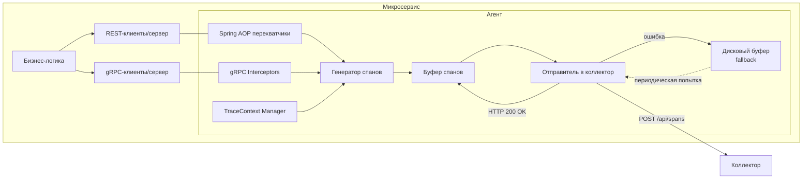

# Агент-библиотека для сбора данных о синхронных вызовах

## 1. Введение

**Агент** – это Java-библиотека (Spring Boot Starter), предназначенная для автоматического сбора телеметрии о синхронных вызовах (REST и gRPC) внутри микросервиса. Она подключается к проекту одной зависимостью и без изменения бизнес-логики начинает перехватывать входящие и исходящие запросы, генерировать спаны (единицы трассировки) и отправлять их в коллектор для дальнейшего анализа.

**Цели агента:**

- Минимальное влияние на производительность основного приложения.
- Прозрачность для разработчика – не требует ручного инструментирования.
- Поддержка сквозной трассировки (W3C TraceContext).
- Надёжная доставка данных даже при временной недоступности коллектора.

## 2. Требования и зависимости

- **Java 21** или выше
- **Spring Boot 3.x** (для REST-перехвата)
- **gRPC-Java** (для gRPC-перехвата, если используется)
- Зависимость от `spring-boot-starter-aop` (для Spring AOP)

## 3. Подключение к проекту

### Maven

```xml
<dependency>
    <groupId>com.sync-analyzer</groupId>
    <artifactId>sync-analyzer-agent-starter</artifactId>
    <version>1.0.0</version>
</dependency>
```

### Gradle

```groovy
implementation 'com.sync-analyzer:sync-analyzer-agent-starter:1.0.0'
```

После подключения агент автоматически конфигурируется (через `spring.factories` или `@AutoConfiguration`) и регистрирует необходимые перехватчики.

## 4. Архитектура агента




## 5. Перехват REST-вызовов

### 5.1. Входящие запросы (сервер)

Для перехвата входящих HTTP-запросов используется **Spring AOP** с аспектом на методах контроллеров, аннотированных `@RequestMapping` (и его производными). Альтернативно можно использовать `HandlerInterceptor`, но AOP проще и не требует конфигурации в `WebMvcConfigurer`.

**Что перехватывается:**

- Методы с `@RestController` / `@Controller`
- Поддерживаются `@GetMapping`, `@PostMapping` и т.д.

**Действия перехватчика:**

1. Извлечение или создание `traceId` и `parentSpanId` из заголовка `traceparent` (по стандарту W3C TraceContext).
2. Генерация нового `spanId` для текущего вызова.
3. Запись времени старта.
4. Выполнение бизнес-метода (через `ProceedingJoinPoint.proceed()`).
5. После завершения формирование спана с длительностью, статусом, путём и т.д.
6. Передача спана в буфер.

### 5.2. Исходящие запросы (клиент)

Для перехвата исходящих REST-вызовов используются:

- `ClientHttpRequestInterceptor` для `RestTemplate`
- `ExchangeFilterFunction` для `WebClient`

**Действия:**

1. Генерация нового `spanId`, привязка к текущему `traceId` (из контекста).
2. Добавление заголовка `traceparent` в исходящий запрос.
3. Замер времени.
4. Формирование спана после получения ответа (или ошибки).

## 6. Перехват gRPC-вызовов

### 6.1. Серверный перехватчик

Реализуется интерфейс `ServerInterceptor`. В методе `interceptCall`:

- Извлекаем `traceId` из метаданных (ключ `traceparent`).
- Генерируем `spanId`.
- Оборачиваем `ServerCall.Listener` для замера времени.
- При завершении вызова формируем спан.

### 6.2. Клиентский перехватчик

Реализуется интерфейс `ClientInterceptor`. В методе `interceptCall`:

- Добавляем в метаданные текущий `traceparent` (полученный из контекста).
- Замеряем время.
- Формируем спан по получению ответа или ошибки.

Оба перехватчика регистрируются при создании каналов/серверов. Для Spring Boot можно использовать `GrpcGlobalClientInterceptor` и `GrpcGlobalServerInterceptor` из `grpc-spring-boot-starter` (опционально).

## 7. Генерация спанов и сквозная трассировка

### 7.1. W3C TraceContext (следует уточнить)

Агент полностью поддерживает стандарт [W3C TraceContext](https://www.w3.org/TR/trace-context/), что обеспечивает совместимость с другими инструментами наблюдаемости.

**Заголовок `traceparent`:**  
`00-<trace-id>-<span-id>-<flags>`  

- `trace-id` – 16 байт в hex (32 символа), глобально уникальный идентификатор всей трассировки.
- `span-id` – 8 байт в hex (16 символов), идентификатор текущего вызова.
- `flags` – байт флагов (например, `01` для выборки).

**Алгоритм работы:**

- При входящем запросе агент ищет заголовок `traceparent`.
  - Если найден, использует `trace-id` и `parent-span-id` (текущий `span-id` из заголовка становится родительским).
  - Если не найден, генерирует новый `trace-id` и `span-id`.
- При исходящем запросе агент создаёт новый `span-id`, устанавливает текущий `trace-id` и формирует новый `traceparent`, который добавляется в заголовки запроса.

### 7.2. Структура спана

Каждый спан представляет один логический шаг в цепочке вызовов. Формат – JSON.

```json
{
  "traceId": "0af7651916cd43dd8448eb211c80319c",
  "spanId": "b7ad6b7169203331",
  "parentSpanId": "b7ad6b7169203330",
  "name": "GET /api/orders/123",
  "serviceName": "order-service",
  "kind": "SERVER", // или "CLIENT"
  "protocol": "REST", // или "gRPC"
  "method": "GET",
  "path": "/api/orders/123",
  "startTime": "2026-03-01T12:00:00.123Z",
  "endTime": "2026-03-01T12:00:00.456Z",
  "durationMs": 333,
  "statusCode": 200,
  "error": null,
  "targetService": null, // для клиентских спанов – имя вызываемого сервиса
  "targetPath": null,
  "tags": {
    "userId": "123",
    "http.request_size": 512
  }
}
```

**Поля:**

- `traceId`, `spanId`, `parentSpanId` – идентификаторы трассировки.
- `name` – краткое описание (например, метод + путь).
- `serviceName` – имя микросервиса (берётся из `spring.application.name` или конфигурации).
- `kind` – `SERVER` (входящий) или `CLIENT` (исходящий).
- `protocol` – `REST` или `gRPC`.
- `method`, `path` – для REST; для gRPC можно хранить полное имя метода.
- `startTime`, `endTime`, `durationMs` – временные метки.
- `statusCode` – HTTP-статус или gRPC-код.
- `error` – сообщение об ошибке (если есть).
- `targetService`, `targetPath` – для клиентских вызовов.
- `tags` – дополнительные метки (настраиваются).

## 8. Асинхронная отправка и буферизация

### 8.1. Основной канал: HTTP(S) в коллектор

- Спаны накапливаются в **оперативной буферной очереди** (ограниченного размера).
- Отдельный поток (или `@Async`) периодически отправляет накопленные спаны батчем в коллектор (POST `/api/spans`).
- При успешном ответе (2xx) спаны удаляются из буфера.
- При ошибке или таймауте спаны перемещаются в **дисковый буфер** (файловое хранилище).

### 8.2. Дисковый буфер (fallback)

- Используется, когда коллектор недоступен.
- Спаны дописываются в JSON-файл (например, `spans-{timestamp}.log`) в ротируемом каталоге.
- Формат файла – каждая строка отдельный JSON-спан (JSON Lines).
- При восстановлении связи с коллектором запускается процесс чтения файлов и повторной отправки.
- После успешной отправки файлы удаляются или архивируются.
- Настраивается максимальный размер дискового буфера и политика ротации.

### 8.3. Политика повторных попыток (требует уточнения значений)

- Экспоненциальная задержка (начальная 1 сек, максимальная 60 сек).
- Ограничение на количество попыток (по умолчанию 5).

## 9. Конфигурационные параметры (требует уточнения списка параметров)

Агент настраивается через стандартный `application.properties` / `application.yml`.

```yaml
analyzer:
  agent:
    enabled: true
    service-name: ${spring.application.name:unknown}
    collector:
      endpoint: http://collector:8081/api/spans
      connect-timeout: 5000
      read-timeout: 5000
    buffer:
      max-size: 10000          # максимальное количество спанов в памяти
      disk-location: /var/log/agent-buffer
      max-disk-size: 1GB
    trace:
      always-sample: true      # всегда записывать спаны (иначе - вероятность)
    intercept:
      rest: true
      grpc: true
    tags:
      environment: test
      version: 1.0.0
```

## 10. Обработка ошибок и логирование

- Все ошибки отправки, буферизации логируются через SLF4J с уровнем WARN/ERROR.
- Агент не должен прерывать выполнение основного приложения – любые исключения в перехватчиках обрабатываются и логируются, после чего управление передаётся дальше.

## 11. Пример использования

### Подключение и запуск

1. Добавить зависимость в `pom.xml`.
2. Убедиться, что в `application.yml` указано имя сервиса:
  ```yaml
   spring:
     application:
       name: order-service
  ```
3. При необходимости настроить адрес коллектора и другие параметры.
4. Запустить приложение. Агент автоматически начнёт сбор данных.

### Проверка работы

- Логи агента покажут инициализацию и периодические отчёты.
- В коллекторе появятся спаны при выполнении HTTP/gRPC запросов.

## 12. Ограничения и дальнейшее развитие

- **Только синхронные вызовы:** асинхронные (брокеры сообщений) не перехватываются.
- **Поддержка только Spring Boot:** для чистых Java-приложений без Spring потребуется ручная интеграция.
- **gRPC-перехват требует наличия gRPC в проекте; если его нет, соответствующий модуль не активируется.
- **В текущей версии не поддерживается выборка (sampling)** – записываются все вызовы; в будущем можно добавить вероятностный sampling.

## 13. Заключение

Агент-библиотека обеспечивает простое, прозрачное и надёжное извлечение телеметрии о синхронных вызовах в микросервисах на Java/Spring. Его архитектура позволяет минимизировать влияние на производительность и гарантировать доставку данных даже в условиях временных сбоев сети.

Следующие шаги – реализация коллектора и анализатора, которые будут обрабатывать спаны, собранные агентом.