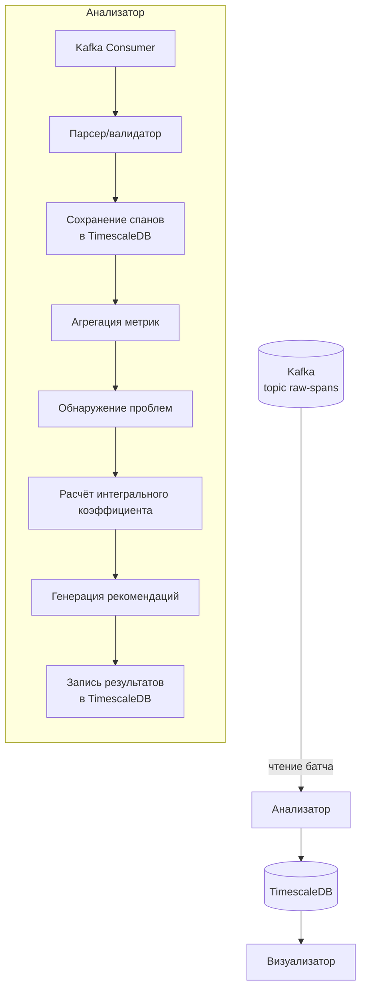

# Анализатор

## 1. Назначение

**Анализатор** — это вычислительное ядро платформы. Он отвечает за:

- Чтение сырых спанов из Kafka
- Сохранение спанов в долговременное хранилище (TimescaleDB)
- Расчёт агрегированных метрик производительности
- Обнаружение архитектурных антипаттернов (N+1, циклы, избыточные вызовы)
- Вычисление интегрального коэффициента качества взаимодействия
- Генерацию текстовых рекомендаций по оптимизации
- Запись результатов обратно в БД для визуализации

Анализатор работает в **пакетном режиме** (периодические запуски) с возможностью триггера по накоплению данных, что оптимально для целей тестирования и не требует низкой задержки реального времени.

## 2. Технологический стек

- **Java 21+**
- **Spring Boot 3.x**
- **Spring Kafka** (для потребления сообщений)
- **Spring Data JPA** / **JDBC Template** (для работы с TimescaleDB)
- **TimescaleDB** (хранилище)
- **Lombok** (опционально)
- **Micrometer** (метрики)

## 3. Архитектура анализатора




## 4. Режимы запуска

### 4.1. Пакетный по расписанию (основной режим)

- Анализатор запускается периодически (например, раз в 5 минуту).
- За один запуск обрабатываются все спаны, накопившиеся в Kafka с момента предыдущего запуска (с учётом committed offset).
- Подходит для большинства сценариев тестирования.

### 4.2. Триггерный по накоплению

- Если в Kafka накопилось больше порогового количества непрочитанных сообщений (например, 10 000), запускается внеочередной анализ.
- Позволяет избежать ситуации, когда при интенсивной нагрузке анализ отстаёт от поступления данных.

Конфигурация (sync-analyzer-config.yml):

```yaml
analyzer:
  scheduler:
    enabled: true
    fixed-rate: 300000  # 300 секунд
  kafka:
    lag-threshold: 10000  # при лаге больше 10 000 запустить внеочередной анализ
```

## 5. Процесс обработки

### 5.1. Чтение из Kafka

- Consumer подписан на топик `raw-spans`.
- При каждом запуске (или постоянно в режиме streaming, если выбран пакетный с сохранением смещений) читается доступный батч сообщений.
- Количество сообщений за один раз ограничивается настройкой `max.poll.records`.
- Для сохранения порядка обработки в рамках одной трассировки важно партиционирование по `traceId` (обеспечено на стороне коллектора).

### 5.2. Сохранение сырых спанов

Каждый прочитанный спан сохраняется в таблицу `spans` TimescaleDB. Используется пакетная вставка (batch insert) для производительности.

**Пример SQL:**

```sql
INSERT INTO spans (time, trace_id, span_id, parent_span_id, service_name, span_data, duration_ms)
VALUES (?, ?, ?, ?, ?, ?::jsonb, ?);
```

Поле `span_data` хранит полный JSON спана для возможности детального просмотра в визуализаторе.

### 5.3. Обновление агрегированных метрик

После сохранения сырых данных (или в отдельном проходе) анализатор обновляет метрики в таблице `endpoint_stats`. Агрегация выполняется за последние временные окна (например, 5 минут, 1 час, 24 часа).

**Пример расчёта p95 latency:**

```sql
SELECT 
    time_bucket('5 minutes', time) AS bucket,
    service_name,
    span_data->>'path' AS path,
    percentile_cont(0.95) WITHIN GROUP (ORDER BY duration_ms) AS p95_latency,
    AVG(CASE WHEN span_data->>'statusCode' LIKE '5%' THEN 1 ELSE 0 END) AS error_rate,
    COUNT(*) AS throughput
FROM spans
WHERE time > NOW() - INTERVAL '1 hour'
GROUP BY bucket, service_name, path;
```

Результаты записываются в `endpoint_stats`.

### 5.4. Обнаружение архитектурных проблем

#### 5.4.1. N+1 запросы

**Алгоритм:**

1. Найти все клиентские спаны (kind=CLIENT), у которых есть родитель (parentSpanId не пуст).
2. Сгруппировать по `(traceId, parentSpanId, targetService, targetPath)`.
3. Если количество спанов в группе больше порога (например, 5) и они произошли в короткий промежуток времени (разница между первым и последним startTime менее 1 секунды) — зафиксировать N+1 проблему.

**Запись в таблицу `architectural_problems`:**

```sql
INSERT INTO architectural_problems 
(trace_id, parent_span_id, service_name, problem_type, description, detected_at)
VALUES (?, ?, 'N_PLUS_ONE', ?);
```

#### 5.4.2. Циклические зависимости

**Алгоритм:**

1. За период (например, последний час) построить ориентированный граф вызовов: вершины — сервисы, рёбра — вызовы (по клиентским спанам).
2. Выполнить поиск циклов (например, алгоритмом Тарьяна или простым обходом в глубину).
3. Для каждого обнаруженного цикла записать проблему.

#### 5.4.3. Избыточные вызовы

**Алгоритм:**

1. В рамках одной трассировки найти повторяющиеся вызовы к одному и тому же эндпоинту с одинаковыми параметрами (можно по path + tags) за короткое время (менее 100 мс).
2. Если такие вызовы есть и между ними не было изменений данных (эвристика), зафиксировать как избыточные.

#### 5.4.4. Глубина цепочки

Для каждой трассировки вычисляется максимальная глубина вложенности вызовов. Если глубина превышает порог (например, 5), фиксируется предупреждение.

### 5.5. Расчёт интегрального коэффициента

Интегральный коэффициент рассчитывается для:

- Каждого эндпоинта (service + path + method)
- Агрегированно для каждого сервиса
- (Опционально) для всей системы

**Компоненты коэффициента (повтор из CONCEPT.md):**


| Компонента  | Обозначение | Нормировка                         |
| ----------- | ----------- | ---------------------------------- |
| p95 latency | L           | `min(1, p95_latency_ms / 500)`     |
| Error rate  | E           | `min(1, error_rate / 0.1)`         |
| Throughput  | T           | `min(1, current_rps / 100)`        |
| N+1 запросы | N           | `1` если есть за период, иначе `0` |
| Циклы       | C           | `1` если сервис в цикле, иначе `0` |
| Глубина     | D           | `min(1, avg_depth / 5)`            |


**Формула:**

```
Score = 0.35*L + 0.25*E + 0.10*T + 0.15*N + 0.10*C + 0.05*D
```

Все компоненты берутся за последний полный час (настраивается).

**Пример SQL-запроса для получения данных:**

```sql
WITH stats AS (
    SELECT 
        service_name,
        path,
        AVG(p95_latency) as avg_latency,
        AVG(error_rate) as avg_error,
        AVG(throughput) as avg_rps
    FROM endpoint_stats
    WHERE bucket > NOW() - INTERVAL '1 hour'
    GROUP BY service_name, path
)
SELECT 
    service_name,
    path,
    LEAST(1, avg_latency / 500) as L,
    LEAST(1, avg_error / 0.1) as E,
    LEAST(1, avg_rps / 100) as T
FROM stats;
```

Результаты сохраняются в таблицу `integration_scores`:

```sql
CREATE TABLE integration_scores (
    time TIMESTAMPTZ DEFAULT NOW(),
    service_name TEXT NOT NULL,
    endpoint_path TEXT,
    score DOUBLE PRECISION NOT NULL,
    components JSONB NOT NULL,  -- {"L": 0.3, "E": 0.0, ...}
    calculated_at TIMESTAMPTZ DEFAULT NOW()
);
```

### 5.6. Генерация рекомендаций

На основе обнаруженных проблем формируются текстовые рекомендации. Каждому типу проблемы сопоставлен шаблон совета.


| Тип проблемы            | Шаблон рекомендации                                                                                                                                                          |
| ----------------------- | ---------------------------------------------------------------------------------------------------------------------------------------------------------------------------- |
| Медленный эндпоинт      | `"Эндпоинт {path} в сервисе {service} имеет высокую задержку (p95={latency}мс). Проверьте индексы в БД, добавьте кеширование или оптимизируйте алгоритмы."`                  |
| Высокий процент ошибок  | `"В сервисе {service} на эндпоинте {path} {error_rate}% ошибок. Проверьте логи, добавьте circuit breaker или retry с экспоненциальной задержкой."`                           |
| N+1 запросы             | `"Обнаружен паттерн N+1: сервис {service} делает {count} запросов к {target} после одного родительского. Используйте @BatchSize, JOIN FETCH или загружайте данные пакетно."` |
| Циклическая зависимость | `"Найдена циклическая зависимость: {cycle}. Рассмотрите выделение общего функционала в отдельный сервис или переход на асинхронное взаимодействие."`                         |
| Избыточные вызовы       | `"В трассировке {traceId} обнаружены повторяющиеся вызовы к {path} за короткое время. Возможно, следует добавить кеширование на стороне клиента."`                           |
| Глубокая цепочка        | `"Цепочка вызовов глубиной {depth} в сервисе {service} превышает рекомендуемый порог. Подумайте об объединении нескольких последовательных вызовов в один."`                 |


Рекомендации записываются в таблицу `recommendations`:

```sql
CREATE TABLE recommendations (
    id BIGSERIAL PRIMARY KEY,
    time TIMESTAMPTZ DEFAULT NOW(),
    problem_type TEXT NOT NULL,
    service_name TEXT NOT NULL,
    endpoint_path TEXT,
    description TEXT NOT NULL,
    recommendation TEXT NOT NULL,
    trace_id TEXT,  -- опционально, для привязки к конкретной трассировке
    resolved BOOLEAN DEFAULT FALSE
);
```

## 6. Конфигурация анализатора

```yaml
analyzer:
  scheduler:
    enabled: true
    fixed-rate: 60000  # мс, 60 секунд
    initial-delay: 10000  # мс, подождать 10 сек после старта
  
  kafka:
    bootstrap-servers: kafka:9092
    topic: raw-spans
    consumer:
      group-id: analyzer-group
      max-poll-records: 500
      auto-offset-reset: earliest
    lag-threshold: 10000  # триггер при лаге больше 10 000

  storage:
    batch-size: 1000  # количество спанов для пакетной вставки
    
  metrics:
    latency-threshold-ms: 500
    error-rate-threshold: 0.1
    rps-capacity: 100
    depth-threshold: 5
    
  weights:
    latency: 0.35
    error-rate: 0.25
    throughput: 0.10
    n-plus-one: 0.15
    cycles: 0.10
    depth: 0.05

spring:
  datasource:
    url: jdbc:postgresql://timescaledb:5432/postgres
    username: postgres
    password: password
    hikari:
      maximum-pool-size: 10
      
logging:
  level:
    com.yourproject.analyzer: INFO
```

## 7. Метрики и мониторинг

Анализатор экспортирует метрики через Micrometer:

- `analyzer.kafka.lag` — текущий лаг по каждой партиции
- `analyzer.spans.processed` — количество обработанных спанов за запуск
- `analyzer.spans.saved` — успешно сохранённые в БД
- `analyzer.problems.found` — найденные проблемы по типам
- `analyzer.scores.calculated` — количество рассчитанных интегральных коэффициентов
- `analyzer.job.duration` — длительность выполнения анализа

Метрики могут быть отправлены в Prometheus и отображены в Grafana для контроля работы самого анализатора.

## 8. Масштабирование

В текущей версии предполагается **один экземпляр анализатора**, так как:

- Объёмы данных в тестовых средах не требуют распределённой обработки.
- Пакетный режим раз в минуту даёт достаточно времени для обработки.
- Задачи анализа не требуют строгой реального времени.

При необходимости горизонтального масштабирования можно:

- Разделить потребление Kafka на несколько групп (например, одна группа для сохранения, другая для анализа).
- Использовать Apache Spark или Flink для потоковой обработки, но это выходит за рамки диплома.

## 9. Заключение

Анализатор — самый сложный и интеллектуальный компонент платформы. Он превращает сырые спаны в полезную информацию: метрики, проблемы, коэффициенты и рекомендации. Его модульная архитектура позволяет легко добавлять новые алгоритмы обнаружения проблем и правила расчёта интегрального коэффициента.

Следующий шаг после реализации анализатора — разработка визуализатора, который представит все эти данные в удобном для разработчика виде.