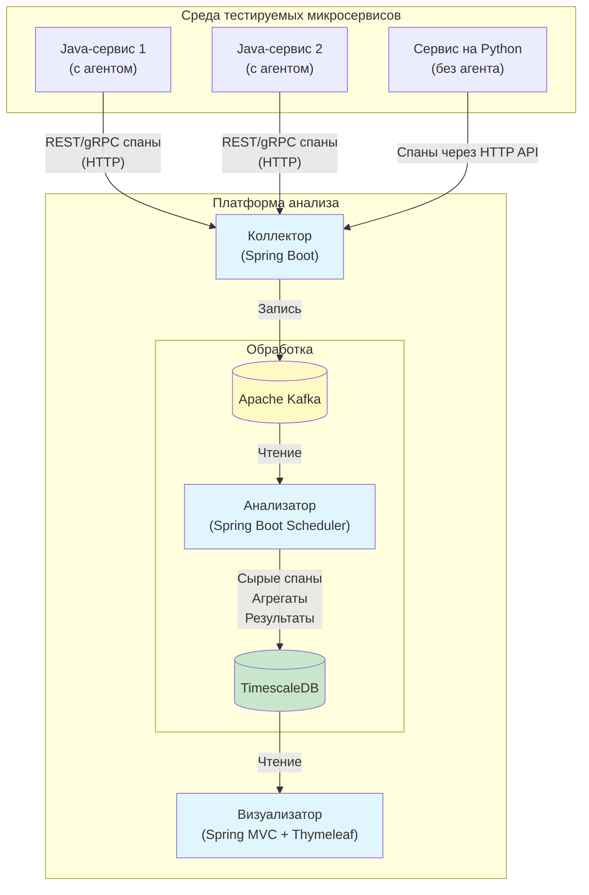

# Архитектура платформы анализа и оптимизации синхронного взаимодействия микросервисов

## 1. Введение

Документ описывает общую архитектуру системы, её компоненты, взаимосвязи, потоки данных и обоснование ключевых технологических решений. Архитектура разработана с учётом требований к наблюдаемости, масштабируемости и лёгкости развёртывания в тестовых средах.

**Ключевые нефункциональные требования:**

- Минимальное влияние на производительность тестируемых сервисов.
- Надёжная доставка данных от агентов до хранилища.
- Возможность горизонтального масштабирования компонентов обработки.
- Поддержка двух протоколов синхронного взаимодействия: REST и gRPC.
- Открытость для интеграции с сервисами на других языках.

## 2. Общая архитектура (диаграмма)

## 3. Компоненты системы

### 3.1 Агент-библиотека (Java)

**Назначение:** автоматический сбор данных о синхронных вызовах внутри Java-микросервисов (на базе Spring Boot) без вмешательства в бизнес-логику.

**Технологии:**

- Java 21+, Spring Boot 3.x
- Spring AOP для перехвата REST-вызовов (`@RestController`, `RestTemplate`, `WebClient`)
- gRPC-Java с `ClientInterceptor` и `ServerInterceptor` для gRPC-вызовов
- Поддержка стандарта W3C TraceContext (заголовки `traceparent`, `tracestate`)
- Асинхронная отправка данных в коллектор по HTTP
- Буферизация на диск при недоступности коллектора (формат JSON)

**Выходные данные:** спаны в формате JSON (см. [AGENT.md](AGENT.md)).

### 3.2 Коллектор

**Назначение:** приём спанов от агентов и внешних сервисов, их валидация, обогащение и надёжная передача в очередь сообщений.

**Технологии:** Spring Boot (WebFlux для неблокирующего ввода-вывода), Kafka Client.

**Функции:**

- REST API `POST /api/spans` (JSON-массив спанов)
- Валидация обязательных полей и временных меток
- Обогащение метаданными (метка окружения, версия сервиса, хост)
- Асинхронная запись в Kafka (топик `raw-spans`, партиционирование по `traceId`)

**Масштабирование:** коллектор stateless, может быть размножен горизонтально.

### 3.3 Очередь сообщений (Apache Kafka)

**Назначение:** буферизация потока данных, отделение этапа приёма от этапа анализа, обеспечение гарантии доставки и возможности повторной обработки.

**Конфигурация: (будет уточнено в будущем)**

- Один топик `raw-spans` с retention 24 часа (настраивается)
- Партиционирование по `traceId` для сохранения порядка спанов внутри одной трассировки
- Репликация 1 (для тестовой среды достаточно)

**Обоснование выбора:** Kafka обеспечивает высокую пропускную способность, отказоустойчивость и экосистему интеграции.

### 3.4 Анализатор

**Назначение:** основной вычислительный компонент. Читает спаны из Kafka, сохраняет их в долговременное хранилище, выполняет агрегацию, поиск проблем и расчёт интегрального коэффициента.

**Технологии:** Spring Boot Scheduler, Spring Data JPA, TimescaleDB.

**Режимы работы:**

- **Пакетный по расписанию** (например, раз в минуту) – для регулярного анализа.
- **Триггерный по накоплению** – если в Kafka накопилось больше порога непрочитанных сообщений, запускается внеочередной анализ.

**Выполняемые задачи:**

1. Чтение батча спанов из Kafka.
2. Сохранение сырых спанов в таблицу `spans` (TimescaleDB).
3. Обновление агрегированных метрик (p95 latency, error rate, throughput) по эндпоинтам за последние временные окна.
4. Выявление архитектурных антипаттернов:
  - N+1 запросы (поиск родителей с большим количеством однотипных дочерних вызовов)
  - Циклические зависимости (построение графа вызовов, обнаружение циклов)
  - Избыточные вызовы (повторяющиеся одинаковые запросы за короткое время)
  - Глубина цепочек (превышение порога)
5. Расчёт интегрального коэффициента для каждого эндпоинта и сервиса.
6. Генерация текстовых рекомендаций на основе обнаруженных проблем.
7. Запись результатов в таблицы `integration_scores` и `recommendations`.

### 3.5 Хранилище (TimescaleDB)

**Назначение:** центральное хранилище всех данных – сырых спанов, агрегатов, результатов анализа.

**Почему TimescaleDB:**

- Расширение PostgreSQL – знакомый SQL, поддержка JPA.
- Гипертаблицы (hypertables) автоматически партиционируют данные по времени, что критично для производительности запросов.
- Встроенные функции для работы с временными рядами (`time_bucket`, `percentile_cont` и др.).
- Поддержка JSONB для гибкого хранения спанов.

**Основные таблицы: (будут уточнены в будущем)**

- `spans` – сырые спаны (гипертаблица по `time`)
- `endpoint_stats` – агрегированные метрики по эндпоинтам (гипертаблица)
- `integration_scores` – значения интегрального коэффициента (с детализацией по компонентам)
- `recommendations` – сгенерированные рекомендации

Детальная схема приведена в [DATABASE.md](DATABASE.md).

### 3.6 Визуализатор

**Назначение:** веб-интерфейс для просмотра данных и результатов анализа.

**Технологии:** Spring MVC, Thymeleaf, Bootstrap, Chart.js.

**Функциональные страницы:**

- **Дашборд** – графики общей нагрузки, топ медленных эндпоинтов, распределение интегральных коэффициентов.
- **Трассировка** – поиск по `traceId`, визуализация цепочки вызовов (timeline).
- **Проблемы и рекомендации** – список с фильтрацией по типу, сервису, времени.
- **Детальный анализ** – таблица интегральных коэффициентов с возможностью «провалиться» в компоненты.

## 4. Потоки данных

1. **Генерация:** Агент в Java-сервисе перехватывает синхронный вызов (REST/gRPC), формирует спан и асинхронно отправляет HTTP POST в коллектор.
2. **Приём:** Коллектор принимает спан, валидирует, обогащает и публикует в Kafka (топик `raw-spans`).
3. **Буферизация:** Kafka хранит сообщения до тех пор, пока анализатор их не прочитает.
4. **Анализ:** Анализатор периодически читает батчи спанов, сохраняет в TimescaleDB и запускает вычислительные задачи.
5. **Хранение:** Все данные (сырые, агрегаты, результаты) хранятся в TimescaleDB.
6. **Визуализация:** Визуализатор выполняет SQL-запросы к БД и отображает информацию пользователю.

## 5. Выбор технологий – обоснование

| Компонент        | Технология             | Альтернативы           | Причины выбора                                                               |
| ---------------- | ---------------------- | ---------------------- | ---------------------------------------------------------------------------- |
| **Агент**        | Spring AOP, gRPC-Java  | Manual instrumentation | Минимальные изменения в коде, использование стандартных механизмов Spring    |
| **Коллектор**    | Spring WebFlux         | Spring MVC, Node.js    | Неблокирующий ввод-вывод для высоких нагрузок, единый стек на Java           |
| **Очередь**      | Apache Kafka           | RabbitMQ, AWS Kinesis  | Высокая пропускная способность, партиционирование, широкое распространение   |
| **Хранилище**    | TimescaleDB            | ClickHouse, InfluxDB   | Знакомый SQL, поддержка JPA, отличная производительность для временных рядов |
| **Анализатор**   | Spring Boot Scheduler  | Apache Flink, Spark    | Достаточно для пакетной обработки, простота разработки, единый стек          |
| **Визуализатор** | Spring MVC + Thymeleaf | React/Vue + REST API   | Минимизация количества разных языков, быстрота разработки прототипа          |

## 6. Масштабирование и надёжность (будет уточнено в будущем)

- **Коллектор:** горизонтальное масштабирование за счёт stateless-архитектуры. Балансировщик распределяет нагрузку.
- **Kafka:** увеличение числа партиций и реплик для повышения пропускной способности и отказоустойчивости.
- **Анализатор:** может быть запущен в нескольких экземплярах с координацией через Kafka (разные группы потребления для разных задач). В текущей версии предполагается один экземпляр.
- **TimescaleDB:** репликация, бэкапы, настройка параметров под нагрузку.
- **Визуализатор:** stateless, масштабируется горизонтально.

**Обработка сбоев:**

- При недоступности коллектора агенты буферизуют спаны на диск.
- При сбое анализатора сообщения в Kafka остаются и будут обработаны после восстановления.
- База данных настраивается с регулярными бэкапами.

## 7. Заключение

Предложенная архитектура обеспечивает полный цикл сбора, надёжной транспортировки, глубокого анализа и визуализации данных о синхронных взаимодействиях микросервисов. Компоненты слабо связаны, каждый может развиваться независимо. Выбор технологий обусловлен балансом между производительностью, простотой реализации и соответствием требованиям дипломного проекта.

Детальное описание каждого компонента см. в соответствующих документах:

- [AGENT.md](AGENT.md) – агент-библиотека
- [COLLECTOR.md](COLLECTOR.md) – коллектор
- [ANALYZER.md](ANALYZER.md) – анализатор
- [DATABASE.md](DATABASE.md) – схема БД
- [VISUALIZER.md](VISUALIZER.md) – визуализатор
- [API.md](API.md) – API коллектора

