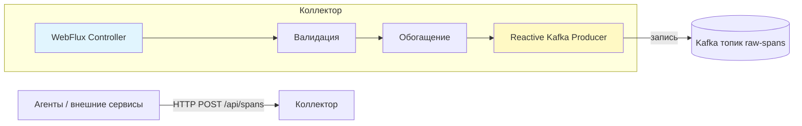

# Коллектор спанов

## 1. Назначение

**Коллектор** – это сервис, отвечающий за приём спанов (телеметрических данных о синхронных вызовах) от агентов и внешних сервисов, их первичную обработку (валидацию, обогащение) и надёжную передачу в Apache Kafka для последующего анализа.

Коллектор является первым звеном серверной части платформы и должен обеспечивать:

- Высокую пропускную способность;
- Минимальную задержку (не блокировать агентов);
- Отказоустойчивость и возможность горизонтального масштабирования.

## 2. Технологический стек

- **Java 21+**
- **Spring Boot 3.x** (реактивный стек WebFlux для неблокирующего ввода-вывода)
- **Reactor Kafka** (асинхронный Kafka-продюсер)
- **Lombok** (опционально)
- **Micrometer** (для метрик)
- **OpenAPI** (для документирования API)

## 3. Архитектура коллектора




Коллектор реализован как реактивное приложение на Spring WebFlux, что позволяет эффективно использовать ресурсы при большом количестве одновременных соединений.

## 4. API коллектора

### 4.1. Эндпоинт приёма спанов

`**POST /api/spans**`

**Заголовки:**

- `Content-Type: application/json`
- (опционально) `X-API-Key` – для аутентификации (если включена)

**Тело запроса:** массив объектов-спанов в формате JSON.

Пример тела запроса:

```json
[
  {
    "traceId": "0af7651916cd43dd8448eb211c80319c",
    "spanId": "b7ad6b7169203331",
    "parentSpanId": "b7ad6b7169203330",
    "name": "GET /api/orders/123",
    "serviceName": "order-service",
    "kind": "SERVER",
    "protocol": "REST",
    "method": "GET",
    "path": "/api/orders/123",
    "startTime": "2026-03-01T12:00:00.123Z",
    "endTime": "2026-03-01T12:00:00.456Z",
    "durationMs": 333,
    "statusCode": 200,
    "error": null,
    "targetService": null,
    "targetPath": null,
    "tags": {}
  }
]
```

**Ответы:**

- `**202 Accepted`** – все спаны приняты и будут обработаны асинхронно.
- `**400 Bad Request`** – ошибка валидации (например, неверный формат JSON, отсутствуют обязательные поля). В теле ответа возвращается описание ошибки.
- `**429 Too Many Requests**` – коллектор временно перегружен (при использовании ограничителя скорости).
- `**500 Internal Server Error**` – внутренняя ошибка сервера.

### 4.2. Дополнительные эндпоинты (опционально)

- `GET /actuator/health` – проверка здоровья.
- `GET /actuator/metrics` – метрики (если включён Spring Boot Actuator).
- `GET /api/docs` – OpenAPI документация.

## 5. Обработка входящих спанов

### 5.1. Валидация

Каждый спан проверяется на наличие обязательных полей:

- `traceId`, `spanId`, `serviceName`, `kind`, `startTime`, `endTime`
- Валидируется формат времени (ISO 8601).
- Проверяется, что `endTime` >= `startTime`.
- При необходимости проверяется допустимость значений (например, `kind` должен быть `SERVER` или `CLIENT`).

При обнаружении невалидного спана коллектор:

- Логирует предупреждение (с частичной информацией об ошибке).
- Отклоняет весь батч (возвращает 400) или пропускает некорректные спаны, продолжая обработку остальных (уточнить в будущем). Выбирается стратегия, настраиваемая через конфигурацию.

### 5.2. Обогащение метаданными

Перед отправкой в Kafka коллектор добавляет к каждому спану служебные поля:

- `_ingest_time` – время получения спана коллектором.
- `_collector_instance` – идентификатор экземпляра коллектора (для отладки).
- `environment` – метка окружения, переданная агентом или заданная в конфигурации коллектора (например, `test`).

При необходимости можно добавить геотеги, версию сервиса (если не передана агентом) и т.д.

### 5.3. Обратное давление (backpressure)

Коллектор использует реактивные механизмы Spring WebFlux для управления обратным давлением. Если Kafka-продюсер не успевает отправлять сообщения, коллектор начинает притормаживать приём новых запросов (через ограничение скорости или буферизацию в очереди с конечной ёмкостью). При переполнении буфера входящие запросы могут отклоняться с кодом 429.

## 6. Запись в Kafka

### 6.1. Топик и партиционирование

- **Имя топика:** `raw-spans` (настраивается).
- **Ключ сообщения:** `traceId` – гарантирует, что все спаны одной трассировки попадут в одну партицию и будут обработаны анализатором в правильном порядке.
- **Значение:** JSON-представление спана (после валидации и обогащения).

### 6.2. Настройки продюсера

Коллектор использует реактивный Kafka-продюсер из проекта `reactor-kafka`. Основные настройки:

- `acks=all` – максимальная надёжность (подтверждение от всех реплик).
- `retries=10` – количество повторов при временных ошибках.
- `enable.idempotence=true` – исключение дубликатов.
- `batch.size` и `linger.ms` – настраиваются для баланса между задержкой и пропускной способностью.
- `max.in.flight.requests.per.connection=5` – разрешено несколько неподтверждённых запросов для увеличения пропускной способности (при идемпотентности это безопасно).

### 6.3. Обработка ошибок записи

- При сбое записи в Kafka (например, недоступность брокера) коллектор логирует ошибку и может вернуть клиенту статус 500 (для синхронного уведомления), но агент уже имеет собственную буферизацию, поэтому потеря данных минимальна.
- Можно настроить повторные попытки внутри продюсера, но важно не блокировать обработку других запросов.

## 7. Конфигурация коллектора

Коллектор настраивается через `sync-analyzer-config.yml`. Пример:

```yaml
server:
  port: 8081
  netty:
    max-connections: 10000

spring:
  application:
    name: span-collector

collector:
  validation:
    strict: true                     # true – отклонять весь батч при ошибке, false – пропускать плохие спаны
  enrichment:
    environment: test
    collector-instance-id: ${HOSTNAME:collector-1}
  kafka:
    topic: raw-spans
    bootstrap-servers: kafka:9092
    producer:
      acks: all
      retries: 10
      batch-size: 16384
      linger-ms: 10
      max-in-flight-requests-per-connection: 5
      enable-idempotence: true

management:
  endpoints:
    web:
      exposure:
        include: health,metrics,prometheus

logging:
  level:
    com.yourproject.collector: INFO
```

## 8. Метрики и мониторинг (уточнить)

Коллектор экспортирует метрики через Micrometer (совместимо с Prometheus):

- `collector.spans.received` – счётчик полученных спанов (с тегами `service`, `protocol`).
- `collector.spans.valid` – успешно прошедшие валидацию.
- `collector.spans.invalid` – отклонённые.
- `collector.spans.kafka.sent` – отправленные в Kafka.
- `collector.spans.kafka.errors` – ошибки отправки.
- `collector.request.duration` – гистограмма времени обработки запроса.
- `collector.buffer.usage` – заполнение внутреннего буфера (если используется).

Эти метрики позволяют отслеживать нагрузку и выявлять проблемы.

## 9. Масштабирование и развёртывание

Коллектор **stateless**, поэтому горизонтальное масштабирование тривиально:

- Запускается несколько экземпляров за балансировщиком нагрузки.
- Каждый экземпляр пишет в один и тот же Kafka-топик (партиционирование по `traceId` обеспечит порядок).
- Для управления конфигурацией рекомендуется использовать централизованный Config Server или переменные окружения в Docker.

**Развёртывание через Docker:**

```dockerfile
FROM eclipse-temurin:17-jre-alpine
COPY target/collector-*.jar app.jar
ENTRYPOINT ["java", "-jar", "/app.jar"]
```

**Docker Compose пример:**

```yaml
collector:
  build: ./collector
  ports:
    - "8081:8081"
  environment:
    SPRING_KAFKA_BOOTSTRAP_SERVERS: kafka:9092
    COLLECTOR_ENRICHMENT_ENVIRONMENT: test
  depends_on:
    - kafka
```

## 10. Обработка ошибок и гарантии доставки

- Коллектор не хранит данные сам, полагаясь на Kafka как на надёжный буфер.
- При сбое коллектора агенты будут буферизовать спаны на диске, поэтому потеря данных исключена (если буфер агента не переполнится).
- При сбое Kafka коллектор будет возвращать ошибки клиентам (агентам), и агенты переключатся на дисковую буферизацию до восстановления Kafka.

Таким образом, коллектор спроектирован с учётом максимальной надёжности и минимального влияния на тестируемые сервисы.

## 11. Заключение

Коллектор является критически важным компонентом платформы, обеспечивающим приём, первичную обработку и надёжную транспортировку спанов. Его реактивная архитектура и интеграция с Kafka позволяют обрабатывать высокие нагрузки и гарантировать доставку данных для последующего анализа.