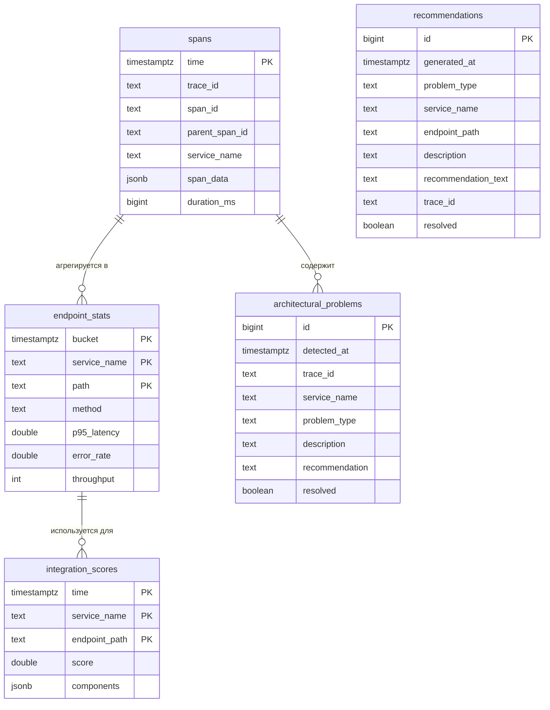

# База данных

## 1. Введение

В качестве основного хранилища платформы выбрана **TimescaleDB** — расширение PostgreSQL, оптимизированное для работы с временными рядами. Такой выбор обусловлен следующими факторами:

- **Знакомый SQL** — низкий порог входа, поддержка JPA/Hibernate (при необходимости)
- **Гипертаблицы (hypertables)** — автоматическое партиционирование данных по времени, что критично для производительности запросов
- **Встроенные функции для временных рядов** — `time_bucket`, `first`, `last`, `percentile_cont` и др.
- **Поддержка JSONB** — гибкое хранение спанов с возможностью индексации
- **Надёжность и экосистема PostgreSQL** — бэкапы, репликация, инструменты администрирования

## 2. Общая схема данных



## 3. Детальное описание таблиц

### 3.1. Таблица `spans` (сырые спаны)

Хранит все спаны, полученные от агентов, в неизменном виде.

```sql
CREATE TABLE spans (
    time TIMESTAMPTZ NOT NULL,
    trace_id TEXT NOT NULL,
    span_id TEXT NOT NULL,
    parent_span_id TEXT,
    service_name TEXT NOT NULL,
    span_data JSONB NOT NULL,
    duration_ms BIGINT GENERATED ALWAYS AS ((span_data->>'durationMs')::bigint) STORED,
    PRIMARY KEY (time, trace_id, span_id)
);

-- Преобразование в гипертаблицу с партиционированием по дням
SELECT create_hypertable('spans', 'time', chunk_time_interval => INTERVAL '1 day');

-- Индексы
CREATE INDEX idx_spans_trace_id ON spans (trace_id);
CREATE INDEX idx_spans_service_name ON spans (service_name);
CREATE INDEX idx_spans_duration ON spans (duration_ms DESC);
CREATE INDEX idx_spans_gin ON spans USING gin (span_data jsonb_path_ops);
```

**Пояснения:**
- `time` — временная метка начала спана (из span_data.startTime)
- Генерируемый столбец `duration_ms` извлекается из JSON для быстрой фильтрации
- JSONB индекс позволяет искать по любым полям спана (например, по коду ошибки)
- Гипертаблица автоматически разбивает данные по дням, что ускоряет запросы за последние часы/дни

### 3.2. Таблица `endpoint_stats` (агрегированные метрики по эндпоинтам)

Содержит предрассчитанные метрики для каждого эндпоинта за временные интервалы.

```sql
CREATE TABLE endpoint_stats (
    bucket TIMESTAMPTZ NOT NULL,
    service_name TEXT NOT NULL,
    path TEXT NOT NULL,
    method TEXT NOT NULL,
    p95_latency DOUBLE PRECISION,
    p99_latency DOUBLE PRECISION,
    error_rate DOUBLE PRECISION,  -- доля ошибок 5xx
    throughput INTEGER,           -- количество запросов в минуту
    created_at TIMESTAMPTZ DEFAULT NOW(),
    PRIMARY KEY (bucket, service_name, path, method)
);

SELECT create_hypertable('endpoint_stats', 'bucket', chunk_time_interval => INTERVAL '1 day');

CREATE INDEX idx_endpoint_stats_service ON endpoint_stats (service_name, bucket DESC);
```

**Агрегация выполняется анализатором** с помощью запросов вида:

```sql
INSERT INTO endpoint_stats (bucket, service_name, path, method, p95_latency, error_rate, throughput)
SELECT
    time_bucket('5 minutes', time) AS bucket,
    service_name,
    span_data->>'path' AS path,
    span_data->>'method' AS method,
    percentile_cont(0.95) WITHIN GROUP (ORDER BY duration_ms) AS p95_latency,
    AVG(CASE 
        WHEN span_data->>'statusCode' LIKE '5%' 
          OR span_data->>'statusCode' IS NULL AND span_data->>'error' IS NOT NULL 
        THEN 1.0 ELSE 0.0 
    END) AS error_rate,
    COUNT(*) AS throughput
FROM spans
WHERE time > NOW() - INTERVAL '1 hour'
GROUP BY bucket, service_name, path, method;
```

### 3.3. Таблица `integration_scores` (интегральные коэффициенты)

Хранит результаты расчёта интегрального коэффициента для каждого эндпоинта и сервиса.

```sql
CREATE TABLE integration_scores (
    time TIMESTAMPTZ NOT NULL DEFAULT NOW(),
    service_name TEXT NOT NULL,
    endpoint_path TEXT,  -- NULL для агрегированных по сервису
    score DOUBLE PRECISION NOT NULL,
    components JSONB NOT NULL,  -- {"L": 0.3, "E": 0.0, "T": 0.1, "N": 0.0, "C": 0.0, "D": 0.0}
    calculated_at TIMESTAMPTZ DEFAULT NOW(),
    PRIMARY KEY (time, service_name, endpoint_path)
);

SELECT create_hypertable('integration_scores', 'time', chunk_time_interval => INTERVAL '7 days');

CREATE INDEX idx_scores_service ON integration_scores (service_name, time DESC);
CREATE INDEX idx_scores_value ON integration_scores (score DESC);
```

**Пример компонентов:**
```json
{
  "L": 0.35,
  "E": 0.0,
  "T": 0.05,
  "N": 1.0,
  "C": 0.0,
  "D": 0.2,
  "weights": {
    "L": 0.35,
    "E": 0.25,
    "T": 0.10,
    "N": 0.15,
    "C": 0.10,
    "D": 0.05
  }
}
```

Хранение компонентов позволяет визуализатору показывать детализацию коэффициента (что именно повлияло).

### 3.4. Таблица `architectural_problems` (обнаруженные архитектурные проблемы)

Содержит информацию о выявленных антипаттернах.

```sql
CREATE TABLE architectural_problems (
    id BIGSERIAL PRIMARY KEY,
    detected_at TIMESTAMPTZ NOT NULL DEFAULT NOW(),
    trace_id TEXT,
    service_name TEXT NOT NULL,
    endpoint_path TEXT,
    problem_type TEXT NOT NULL,  -- 'N_PLUS_ONE', 'CYCLE', 'REDUNDANT_CALL', 'DEEP_CHAIN'
    description TEXT NOT NULL,
    recommendation TEXT NOT NULL,
    resolved BOOLEAN DEFAULT FALSE,
    resolved_at TIMESTAMPTZ,
    metadata JSONB  -- дополнительные данные (например, количество запросов для N+1)
);

CREATE INDEX idx_problems_type ON architectural_problems (problem_type);
CREATE INDEX idx_problems_service ON architectural_problems (service_name);
CREATE INDEX idx_problems_resolved ON architectural_problems (resolved);
```

**Пример записи для N+1:**
```json
{
  "problem_type": "N_PLUS_ONE",
  "description": "Сервис order-service сделал 15 запросов к payment-service после одного запроса /api/orders/123",
  "recommendation": "Используйте @BatchSize или JOIN FETCH в запросе, либо загружайте платежи пакетно",
  "metadata": {
    "parent_span_id": "abc123",
    "count": 15,
    "target_service": "payment-service",
    "target_path": "/api/payments/by-order"
  }
}
```

### 3.5. Таблица `recommendations` (рекомендации)

Фактически дублирует часть полей из `architectural_problems`, но может содержать обобщённые рекомендации, не привязанные к конкретной трассе. В простейшем случае можно обойтись одной таблицей `architectural_problems`, но для гибкости разделим.

```sql
CREATE TABLE recommendations (
    id BIGSERIAL PRIMARY KEY,
    generated_at TIMESTAMPTZ NOT NULL DEFAULT NOW(),
    problem_type TEXT NOT NULL,
    service_name TEXT NOT NULL,
    endpoint_path TEXT,
    description TEXT NOT NULL,
    recommendation_text TEXT NOT NULL,
    trace_id TEXT,
    resolved BOOLEAN DEFAULT FALSE
);

CREATE INDEX idx_recommendations_service ON recommendations (service_name);
CREATE INDEX idx_recommendations_type ON recommendations (problem_type);
```

## 4. Политика хранения данных (TTL)

Учитывая, что платформа ориентирована на тестирование, а не на production, можно установить относительно недолгий срок хранения сырых данных.

```sql
-- Удалять сырые спаны старше 7 дней
SELECT add_retention_policy('spans', INTERVAL '7 days');

-- Удалять агрегированные метрики старше 30 дней
SELECT add_retention_policy('endpoint_stats', INTERVAL '30 days');

-- Удалять интегральные коэффициенты старше 90 дней
SELECT add_retention_policy('integration_scores', INTERVAL '90 days');
```

Проблемы и рекомендации хранятся бессрочно (или пока не будут помечены как решённые).

## 5. Примеры часто используемых запросов

### 5.1. Получить последние 10 трасс с ошибками

```sql
SELECT DISTINCT trace_id, MIN(time) as first_seen, MAX(time) as last_seen,
       COUNT(*) as span_count, 
       SUM(CASE WHEN span_data->>'statusCode' LIKE '5%' THEN 1 ELSE 0 END) as error_count
FROM spans
WHERE time > NOW() - INTERVAL '1 hour'
GROUP BY trace_id
HAVING SUM(CASE WHEN span_data->>'statusCode' LIKE '5%' THEN 1 ELSE 0 END) > 0
ORDER BY last_seen DESC
LIMIT 10;
```

### 5.2. Получить все спаны для конкретной трассы

```sql
SELECT * FROM spans
WHERE trace_id = '0af7651916cd43dd8448eb211c80319c'
ORDER BY time;
```

### 5.3. Топ-10 медленных эндпоинтов за последний час

```sql
SELECT service_name, span_data->>'path' as path,
       AVG(duration_ms) as avg_duration,
       MAX(duration_ms) as max_duration,
       percentile_cont(0.95) WITHIN GROUP (ORDER BY duration_ms) as p95,
       COUNT(*) as calls
FROM spans
WHERE time > NOW() - INTERVAL '1 hour'
GROUP BY service_name, span_data->>'path'
ORDER BY p95 DESC
LIMIT 10;
```

### 5.4. Динамика интегрального коэффициента для сервиса

```sql
SELECT time_bucket('5 minutes', time) as bucket,
       AVG(score) as avg_score
FROM integration_scores
WHERE service_name = 'order-service' 
  AND time > NOW() - INTERVAL '6 hours'
GROUP BY bucket
ORDER BY bucket;
```

### 5.5. Неразрешённые проблемы по типам

```sql
SELECT problem_type, COUNT(*) as count
FROM architectural_problems
WHERE NOT resolved
GROUP BY problem_type
ORDER BY count DESC;
```

## 6. Индексы и оптимизация производительности

### 6.1. Ключевые индексы

```sql
-- Для быстрого поиска по traceId
CREATE INDEX idx_spans_trace_id ON spans (trace_id);

-- Для фильтрации по времени и сервису
CREATE INDEX idx_spans_service_time ON spans (service_name, time DESC);

-- Для агрегаций по длительности
CREATE INDEX idx_spans_duration ON spans (duration_ms DESC) WHERE duration_ms > 100;

-- Для JSON-поля (поиск по конкретным тегам)
CREATE INDEX idx_spans_tags ON spans USING gin ((span_data->'tags'));

-- Для таблицы проблем
CREATE INDEX idx_problems_unresolved ON architectural_problems (detected_at DESC) WHERE NOT resolved;
```

### 6.2. Советы по настройке TimescaleDB

- Установить `timescaledb.telemetry_level=off` (отключить телеметрию)
- Для гипертаблиц настроить сжатие (compression) для старых чанков:

```sql
ALTER TABLE spans SET (
    timescaledb.compress,
    timescaledb.compress_segmentby = 'service_name',
    timescaledb.compress_orderby = 'time DESC'
);

SELECT add_compression_policy('spans', INTERVAL '3 days');
```

## 7. Миграции и управление схемой

Для управления версиями схемы рекомендуется использовать **Flyway** или **Liquibase**. Пример миграции Flyway:

```sql
-- V1__initial_schema.sql
CREATE TABLE spans (...);
SELECT create_hypertable('spans', 'time');

-- V2__add_endpoint_stats.sql
CREATE TABLE endpoint_stats (...);
SELECT create_hypertable('endpoint_stats', 'bucket');

-- V3__add_integration_scores.sql
CREATE TABLE integration_scores (...);
SELECT create_hypertable('integration_scores', 'time');
```

## 8. Заключение

Предложенная схема полностью покрывает потребности платформы:
- Эффективное хранение и запросы к временным рядам (спаны, метрики)
- Гибкость JSONB для спанов и компонентов коэффициента
- Автоматическое партиционирование и политики хранения
- Поддержка сложных аналитических запросов через SQL

При необходимости схему можно расширить дополнительными таблицами (например, для хранения пользовательских настроек), но для MVP она достаточна.