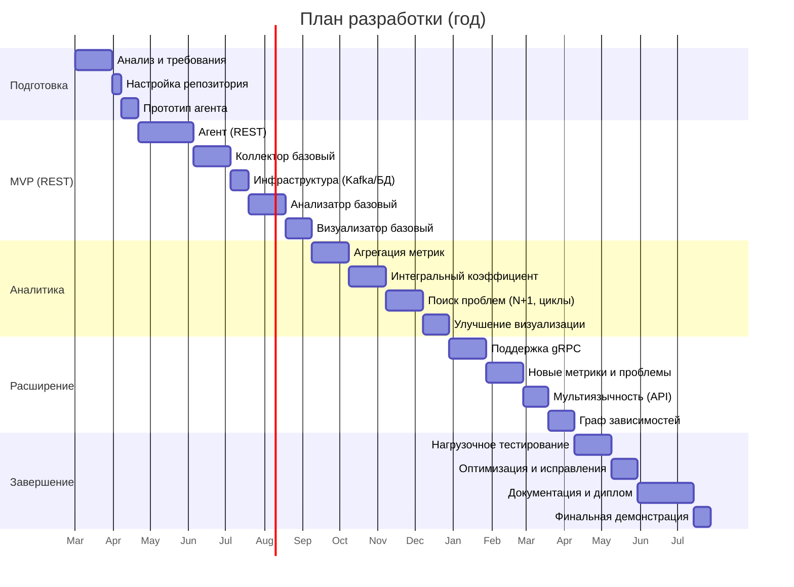

# План разработки (Roadmap)

## 1. Введение

Данный документ описывает поэтапный план разработки платформы интеллектуального анализа и оптимизации синхронного взаимодействия между микросервисами. План рассчитан на **один год** и разбит на **4 квартала** (или 2 семестра для дипломного проекта). Каждый этап содержит конкретные цели, ожидаемые результаты и примерные временные затраты.

План является гибким и может корректироваться по мере выполнения работ, но служит ориентиром для контроля прогресса.

---

## 2. Обозначения

- **MVP** (Minimum Viable Product) — минимально жизнеспособный продукт, обладающий core-функционалом.
- **Milestone** — контрольная точка, значимый результат.
- **Риск** — потенциальная проблема, требующая внимания.

---

## 3. Этапы разработки

### **Этап 0: Подготовительный (Месяц 0–1)**

**Цель:** Формализация требований, утверждение темы, настройка окружения.

| Задача | Длительность | Результат |
|--------|--------------|-----------|
| Анализ существующих решений и литературы | 2 недели | Обзорная глава диплома, список аналогов |
| Формулирование требований к системе | 1 неделя | Техническое задание (SRS) |
| Выбор технологического стека | 3 дня | Утверждённый стек (Java 17+, Spring Boot, Kafka, TimescaleDB) |
| Настройка репозитория, CI (GitLab CI / GitHub Actions) | 3 дня | Репозиторий с базовой структурой, автоматическая сборка |
| Создание прототипа агента (базовый перехват REST) | 1 неделя | Демонстрация возможности перехвата и отправки спана в консоль |

**Milestone 0:** Утверждённая концепция, готовый репозиторий, работающий прототип агента.

---

### **Этап 1: Разработка ядра (Месяцы 2–4)**

**Цель:** Создание MVP: агент (REST), коллектор, минимальное хранилище, простейший анализатор (сохранение спанов).

#### 1.1. Агент-библиотека (REST)

- Реализация перехвата входящих и исходящих REST-запросов через Spring AOP.
- Генерация traceId/spanId, поддержка W3C TraceContext.
- Асинхронная отправка спанов в коллектор (HTTP).
- Буферизация на диск при недоступности коллектора.
- Конфигурация через `application.yml`.

**Результат:** Готовый JAR-артефакт агента, который можно подключить к тестовому приложению.

#### 1.2. Коллектор (базовый)

- REST API `POST /api/spans` (приём массива спанов).
- Валидация обязательных полей.
- Запись в Kafka (топик `raw-spans`).
- Конфигурация и метрики (Actuator).

**Результат:** Работающий коллектор, принимающий спаны и публикующий их в Kafka.

#### 1.3. Инфраструктура: Kafka + TimescaleDB

- Настройка docker-compose для Kafka, Zookeeper, TimescaleDB.
- Инициализация БД (таблица `spans` с гипертаблицей).

**Результат:** Стек поднимается одной командой.

#### 1.4. Анализатор (базовый)

- Чтение спанов из Kafka (Kafka Consumer).
- Сохранение спанов в TimescaleDB (пакетная вставка).
- Простейший REST API для проверки (количество спанов).

**Результат:** Спаны сохраняются в БД, целостность данных подтверждена.

#### 1.5. Визуализатор (базовый)

- Страница со списком последних спанов (таблица).
- Простой просмотр трассы по traceId.

**Результат:** Минимальный веб-интерфейс для проверки работы.

**Milestone 1 (Конец 4 месяца):** MVP готов — данные проходят путь от агента до визуализатора. Можно продемонстрировать end-to-end работу.

---

### **Этап 2: Аналитика и метрики (Месяцы 5–7)**

**Цель:** Добавление расчёта метрик, интегрального коэффициента, обнаружение базовых проблем.

#### 2.1. Агрегация метрик в анализаторе

- Расчёт p95 latency, error rate, throughput по эндпоинтам.
- Сохранение в таблицу `endpoint_stats`.
- Настройка периодического запуска (Scheduler).

#### 2.2. Интегральный коэффициент

- Реализация нормировки компонентов (latency, error rate, throughput, позже — структурные).
- Вычисление коэффициента для каждого эндпоинта/сервиса.
- Сохранение в `integration_scores`.
- Интерфейс для просмотра коэффициента (цветовая индикация).

#### 2.3. Обнаружение структурных проблем (первые два)

- **N+1 запросы:** алгоритм поиска по клиентским спанам.
- **Циклические зависимости:** построение графа сервисов, поиск циклов.
- Сохранение проблем в `architectural_problems`.
- Генерация простых рекомендаций (шаблонных).

#### 2.4. Расширение визуализатора

- Дашборд с графиками (Chart.js) для latency, error rate.
- Страница "Проблемы" со списком и рекомендациями.
- Отображение интегрального коэффициента на дашборде.

**Milestone 2 (Конец 7 месяца):** Платформа не только собирает, но и анализирует данные, выдаёт первые рекомендации. Можно продемонстрировать обнаружение N+1 и циклов.

---

### **Этап 3: Расширение функциональности (Месяцы 8–10)**

**Цель:** Поддержка gRPC, улучшение алгоритмов, добавление новых метрик, мультиязычность.

#### 3.1. Поддержка gRPC в агенте

- Добавление gRPC-перехватчиков (ClientInterceptor, ServerInterceptor).
- Генерация спанов для gRPC-вызовов.
- Тестирование на примере gRPC-сервиса.

#### 3.2. Доработка анализатора

- Учёт протокола (REST/gRPC) в метриках.
- Добавление новых типов проблем:
  - Избыточные вызовы (redundant calls).
  - Глубина цепочки (depth).
- Уточнение весов интегрального коэффициента экспертным методом (опрос).

#### 3.3. Мультиязычность

- Публикация OpenAPI-спецификации для коллектора.
- Примеры отправки спанов из Python, Node.js, Go (документация и сниппеты).
- Тестирование интеграции с не-Java сервисами.

#### 3.4. Улучшение визуализатора

- Граф зависимостей сервисов (D3.js / Cytoscape).
- Фильтры по времени, сервисам, типам проблем.
- Экспорт отчёта (PDF/HTML) — опционально.

**Milestone 3 (Конец 10 месяца):** Полноценная платформа с поддержкой REST и gRPC, расширенной аналитикой и документацией для других языков.

---

### **Этап 4: Тестирование, оптимизация, документация (Месяцы 11–12)**

**Цель:** Подготовка к защите, финальное тестирование, написание диплома.

#### 4.1. Нагрузочное тестирование

- Запуск демо-стенда с 5–7 микросервисами.
- Генерация нагрузки (JMeter, Gatling) с внесёнными проблемами.
- Проверка корректности обнаружения и производительности компонентов.

#### 4.2. Оптимизация

- Улучшение производительности анализатора (индексы, оптимизация запросов).
- Настройка буферизации агента.
- Исправление выявленных багов.

#### 4.3. Документация

- Завершение всех .md-файлов (README, CONCEPT, ARCHITECTURE, AGENT, COLLECTOR, ANALYZER, VISUALIZER, DATABASE, API, DEPLOYMENT, GLOSSARY, ROADMAP).
- Подготовка пользовательского руководства.
- Оформление дипломной работы (пояснительная записка, презентация).

#### 4.4. Финальная демонстрация

- Сборка релизного образа.
- Запись видео-демонстрации (опционально).
- Подготовка речи защиты.

**Milestone 4 (Конец 12 месяца):** Готовый продукт, полностью задокументированный, успешно протестированный. Защита диплома.

---

## 4. График (диаграмма Ганта)

---

## 5. Риски и их mitigation

| Риск | Вероятность | Влияние | План снижения |
|------|-------------|---------|---------------|
| Сложность реализации gRPC-перехватчиков | Средняя | Среднее | Заложить больше времени на исследование, использовать готовые примеры. |
| Производительность агента (overhead) | Средняя | Высокое | Тщательное профилирование, асинхронность, настраиваемый уровень сэмплинга. |
| Непредвиденные проблемы с Kafka | Низкая | Среднее | Использовать docker-образы с готовыми конфигами, изучить документацию. |
| Изменение требований в ходе диплома | Средняя | Среднее | Гибкое планирование, регулярные встречи с руководителем. |
| Перегрузка анализатора при большом количестве спанов | Низкая | Среднее | Оптимизация запросов, индексы, возможность увеличения интервала анализа. |
| Срыв сроков | Средняя | Высокое | Чёткое следование roadmap, приоритизация MVP, возможное сокращение второстепенных функций. |

---

## 6. Ключевые результаты (Deliverables)

- **Месяц 4:** MVP (REST-агент, коллектор, сохранение в БД, базовый UI).
- **Месяц 7:** Аналитическая версия (метрики, интегральный коэффициент, базовые проблемы).
- **Месяц 10:** Расширенная версия (gRPC, мультиязычность, граф зависимостей).
- **Месяц 12:** Финальный продукт + дипломная работа.

---

## 7. Заключение

Данный roadmap представляет реалистичный план разработки с учётом дипломного графика. Он может быть скорректирован по согласованию с руководителем. Основной фокус — получение работающего MVP к середине проекта, что позволит далее наращивать функциональность без риска остаться без результата.

Успешное выполнение всех этапов гарантирует создание полноценного инструмента, способного стать основой дипломной работы и демонстрировать высокий уровень инженерной подготовки.