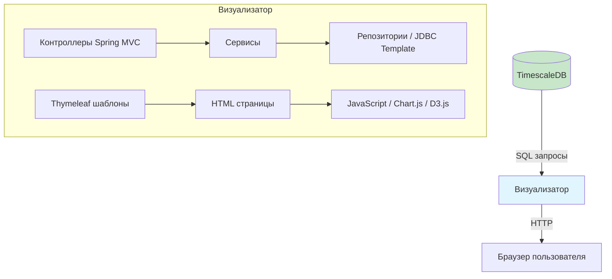

# Визуализатор

## 1. Назначение

**Визуализатор** — это веб-интерфейс платформы, предоставляющий разработчикам и архитекторам наглядное представление всех собранных и проанализированных данных. Он позволяет:

- Просматривать распределённые трассы (trace) в удобном формате (timeline, граф)
- Отслеживать метрики производительности в реальном времени (с задержкой до 1 минуты)
- Видеть интегральные коэффициенты по сервисам и эндпоинтам
- Изучать список обнаруженных проблем и получать конкретные рекомендации
- Фильтровать данные по времени, сервисам, типам проблем
- Экспортировать отчёты (опционально)

Визуализатор не должен быть перегружен сложной логикой — его задача только читать данные из БД и отображать их.

## 2. Технологический стек

- **Java 21+**
- **Spring MVC** — для серверной части и рендеринга шаблонов
- **Thymeleaf** — шаблонизатор для генерации HTML
- **Bootstrap 5** — CSS-фреймворк для адаптивного дизайна
- **Chart.js** — библиотека для построения графиков на клиенте
- **D3.js** / **Cytoscape.js** (опционально) — для визуализации графов зависимостей
- **TimescaleDB** — чтение данных через JPA или JDBC Template
- **WebJars** — для управления статическими ресурсами (Bootstrap, Chart.js)

**Обоснование выбора:**

- Thymeleaf позволяет оставаться в экосистеме Java, не создавая отдельный фронтенд-проект.
- Bootstrap обеспечивает современный вид без глубоких знаний CSS.
- Chart.js прост в использовании и достаточен для большинства графиков.
- При необходимости сложной визуализации графов можно подключить Cytoscape.js.

## 3. Архитектура визуализатора




## 4. Структура страниц

### 4.1. Главный дашборд (Dashboard)

**URL:** `/` или `/dashboard`

**Назначение:** общий обзор состояния системы, быстрая идентификация проблем.

**Элементы:**

- **Карточки (KPI):**
  - Общее количество сервисов
  - Количество активных трасс за последний час
  - Средний интегральный коэффициент по системе (с цветовой индикацией)
  - Количество нерешённых проблем
- **Графики:**
  - **График latency (p50, p95, p99)** по времени (интерактивный, можно выбрать сервис)
  - **График error rate** (процент ошибок по времени)
  - **График throughput** (RPS)
- **Топ-5 медленных эндпоинтов** (таблица с интегральным коэффициентом и ссылкой на детали)
- **Топ-5 последних проблем** (с кратким описанием и рекомендацией)
- **Кнопка "Обновить"** (или автообновление каждые 30 секунд)

### 4.2. Список трасс (Traces)

**URL:** `/traces`

**Назначение:** поиск и просмотр распределённых трасс.

**Функции:**

- **Фильтры:**
  - По временному диапазону (picker)
  - По сервису (выпадающий список)
  - По длительности (больше/меньше N мс)
  - По статусу (только с ошибками)
  - По traceId (точный поиск)
- **Таблица трасс:**
  - TraceId (первые символы + кнопка копирования)
  - Количество спанов
  - Общая длительность
  - Код статуса (успех/ошибка)
  - Время начала
  - Действие "Подробнее"
- **Пагинация** (по 20 трасс)

### 4.3. Детальная трассировка (Trace Detail)

**URL:** `/traces/{traceId}`

**Назначение:** визуализация цепочки вызовов внутри одной трассировки.

**Элементы:**

- **Информация о трассе:**
  - TraceId
  - Общая длительность
  - Количество задействованных сервисов
- **Визуализация:**
  - **Вариант 1 (простой):** Timeline (диаграмма Ганта) с помощью Chart.js или самописного компонента.
  - **Вариант 2 (сложный):** Граф зависимостей с помощью D3.js или Cytoscape.js, показывающий, как сервисы вызывают друг друга.
- **Таблица спанов:** все спаны трассы с возможностью сортировки и фильтрации.
- **Связанные проблемы:** если для этой трассы были зафиксированы проблемы (например, N+1), они отображаются здесь.

### 4.4. Аналитика (Analytics)

**URL:** `/analytics`

**Назначение:** детальный анализ метрик и интегральных коэффициентов.

**Вкладки:**

#### 4.4.1. Интегральные коэффициенты

- **Таблица по эндпоинтам:**
  - Сервис
  - Эндпоинт (путь + метод)
  - Интегральный коэффициент (с цветовой индикацией)
  - Значения компонентов (latency, error rate, ...) в виде прогресс-баров или чисел
  - Кнопка "Детали" (переход к графику компонентов)
- **Возможность экспорта в CSV/PDF** (опционально)

#### 4.4.2. Метрики по времени

- Графики latency, error rate, throughput для выбранного сервиса/эндпоинта за период
- Возможность сравнения нескольких эндпоинтов

#### 4.4.3. Граф зависимостей сервисов

- Интерактивный граф, где узлы — сервисы, рёбра — вызовы
- Толщина ребра отражает интенсивность вызовов
- Цвет узла отражает средний интегральный коэффициент сервиса
- При клике на узел — показать детали сервиса

### 4.5. Проблемы и рекомендации (Problems)

**URL:** `/problems`

**Назначение:** централизованный просмотр всех обнаруженных проблем и советов.

**Элементы:**

- **Фильтры:**
  - По типу проблемы (N+1, цикл, медленный эндпоинт, ...)
  - По сервису
  - По статусу (решена/не решена)
  - По дате
- **Список проблем (карточки или таблица):**
  - Тип проблемы (иконка)
  - Описание (например, "N+1 запрос в сервисе order-service")
  - Сервис/эндпоинт
  - Дата обнаружения
  - Рекомендация (текст)
  - Кнопка "Отметить как решённую" (опционально, можно хранить статус в БД)
  - Кнопка "Посмотреть трассу" (если проблема привязана к конкретной трассировке)

### 4.6. Настройки (Settings) — опционально

**URL:** `/settings`

**Назначение:** настройка пороговых значений, весов интегрального коэффициента и других параметров платформы (только для администраторов). В демо-версии может отсутствовать.

## 5. Реализация страниц (примеры кода)

### 5.1. Контроллер для дашборда

```java
@Controller
public class DashboardController {
    
    private final MetricService metricService;
    private final ProblemService problemService;
    
    @GetMapping("/")
    public String dashboard(Model model) {
        // KPI
        model.addAttribute("serviceCount", metricService.getServiceCount());
        model.addAttribute("activeTraces", metricService.getActiveTracesCount());
        model.addAttribute("avgScore", metricService.getAverageIntegrationScore());
        model.addAttribute("openProblems", problemService.getOpenProblemsCount());
        
        // Графики
        model.addAttribute("latencyData", metricService.getLatencyChartData());
        model.addAttribute("errorRateData", metricService.getErrorRateChartData());
        model.addAttribute("throughputData", metricService.getThroughputChartData());
        
        // Топ-5
        model.addAttribute("topSlowEndpoints", metricService.getTopSlowEndpoints(5));
        model.addAttribute("recentProblems", problemService.getRecentProblems(5));
        
        return "dashboard";
    }
}
```

### 5.2. HTML-шаблон дашборда (Thymeleaf + Bootstrap + Chart.js)

**dashboard.html** (фрагмент):

```html
<!DOCTYPE html>
<html xmlns:th="http://www.thymeleaf.org">
<head>
    <title>СинхронАналитик - Дашборд</title>
    <link rel="stylesheet" th:href="@{/webjars/bootstrap/5.3.0/css/bootstrap.min.css}">
    <script th:src="@{/webjars/chart.js/4.4.0/dist/chart.umd.min.js}"></script>
</head>
<body>
    <div class="container mt-4">
        <h1 class="mb-4">📊 Дашборд</h1>
        
        <!-- KPI карточки -->
        <div class="row">
            <div class="col-md-3">
                <div class="card text-white bg-primary mb-3">
                    <div class="card-header">Сервисы</div>
                    <div class="card-body">
                        <h2 class="card-title" th:text="${serviceCount}">0</h2>
                    </div>
                </div>
            </div>
            <div class="col-md-3">
                <div class="card text-white bg-success mb-3">
                    <div class="card-header">Активные трассы</div>
                    <div class="card-body">
                        <h2 class="card-title" th:text="${activeTraces}">0</h2>
                    </div>
                </div>
            </div>
            <div class="col-md-3">
                <div th:classappend="${avgScore < 0.4 ? 'bg-success' : (avgScore < 0.6 ? 'bg-warning' : 'bg-danger')}" 
                     class="card text-white mb-3">
                    <div class="card-header">Ср. интегральный коэффициент</div>
                    <div class="card-body">
                        <h2 class="card-title" th:text="${#numbers.formatDecimal(avgScore, 1, 2)}">0.00</h2>
                    </div>
                </div>
            </div>
            <div class="col-md-3">
                <div class="card text-white bg-info mb-3">
                    <div class="card-header">Открытые проблемы</div>
                    <div class="card-body">
                        <h2 class="card-title" th:text="${openProblems}">0</h2>
                    </div>
                </div>
            </div>
        </div>
        
        <!-- Графики -->
        <div class="row mt-4">
            <div class="col-md-6">
                <div class="card">
                    <div class="card-header">Latency (p95)</div>
                    <div class="card-body">
                        <canvas id="latencyChart" width="400" height="200"></canvas>
                    </div>
                </div>
            </div>
            <div class="col-md-6">
                <div class="card">
                    <div class="card-header">Error Rate</div>
                    <div class="card-body">
                        <canvas id="errorChart" width="400" height="200"></canvas>
                    </div>
                </div>
            </div>
        </div>
        
        <!-- Топ-5 медленных эндпоинтов -->
        <div class="row mt-4">
            <div class="col-md-6">
                <div class="card">
                    <div class="card-header">Топ-5 медленных эндпоинтов</div>
                    <div class="card-body">
                        <table class="table table-striped">
                            <thead>
                                <tr>
                                    <th>Сервис</th>
                                    <th>Эндпоинт</th>
                                    <th>Коэф.</th>
                                    <th></th>
                                </tr>
                            </thead>
                            <tbody>
                                <tr th:each="ep : ${topSlowEndpoints}">
                                    <td th:text="${ep.serviceName}">order</td>
                                    <td th:text="${ep.path}">/api/orders</td>
                                    <td>
                                        <span th:classappend="${ep.score < 0.4 ? 'bg-success' : (ep.score < 0.6 ? 'bg-warning' : 'bg-danger')}" 
                                              class="badge" th:text="${#numbers.formatDecimal(ep.score, 1, 2)}">0.00</span>
                                    </td>
                                    <td><a th:href="@{'/analytics?endpoint=' + ${ep.id}}" class="btn btn-sm btn-primary">Детали</a></td>
                                </tr>
                            </tbody>
                        </table>
                    </div>
                </div>
            </div>
            
            <!-- Последние проблемы -->
            <div class="col-md-6">
                <div class="card">
                    <div class="card-header">Последние проблемы</div>
                    <div class="card-body">
                        <div th:each="problem : ${recentProblems}" class="alert alert-warning">
                            <strong th:text="${problem.type}">N+1</strong>:
                            <span th:text="${problem.description}">обнаружен N+1 запрос</span>
                            <br>
                            <small th:text="${#temporals.format(problem.detectedAt, 'dd.MM.yyyy HH:mm')}">01.03.2026 12:00</small>
                            <a th:href="@{'/problems/' + ${problem.id}}" class="btn btn-sm btn-outline-primary float-end">Подробнее</a>
                        </div>
                    </div>
                </div>
            </div>
        </div>
    </div>
    
    <script th:inline="javascript">
        // Данные из модели
        var latencyData = [[${latencyData}]];
        var errorData = [[${errorRateData}]];
        
        // График latency
        new Chart(document.getElementById('latencyChart'), {
            type: 'line',
            data: {
                labels: latencyData.labels,
                datasets: [{
                    label: 'p95 latency (ms)',
                    data: latencyData.values,
                    borderColor: 'rgb(75, 192, 192)'
                }]
            }
        });
        
        // График error rate
        new Chart(document.getElementById('errorChart'), {
            type: 'line',
            data: {
                labels: errorData.labels,
                datasets: [{
                    label: 'Error rate (%)',
                    data: errorData.values,
                    borderColor: 'rgb(255, 99, 132)'
                }]
            }
        });
    </script>
</body>
</html>
```

## 6. API визуализатора (внутреннее)

Визуализатор не предоставляет внешнего API, но его контроллеры могут отдавать JSON-данные для асинхронной подгрузки графиков (AJAX). Это позволяет обновлять графики без перезагрузки всей страницы.

**Пример JSON-эндпоинта для графика:**

```
GET /api/charts/latency?service=order-service&hours=6
```

```json
{
  "labels": ["12:00", "12:05", "12:10", ...],
  "p50": [120, 125, 118, ...],
  "p95": [250, 280, 260, ...],
  "p99": [400, 420, 410, ...]
}
```

## 7. Взаимодействие с базой данных

Визуализатор использует **только чтение** из БД. Запись не производится (кроме опционального обновления статуса проблемы).

### Пример репозитория для метрик:

```java
@Repository
public class MetricRepository {
    
    private final JdbcTemplate jdbcTemplate;
    
    public List<EndpointScore> getTopSlowEndpoints(int limit) {
        String sql = """
            SELECT service_name, endpoint_path, score, components
            FROM integration_scores
            WHERE time > NOW() - INTERVAL '1 hour'
            ORDER BY score DESC
            LIMIT ?
            """;
        return jdbcTemplate.query(sql, new EndpointScoreRowMapper(), limit);
    }
    
    public ChartData getLatencyChartData(String service, int hours) {
        String sql = """
            SELECT 
                time_bucket('5 minutes', bucket) as time,
                AVG(p95_latency) as p95
            FROM endpoint_stats
            WHERE service_name = ? AND bucket > NOW() - INTERVAL '? hours'
            GROUP BY time
            ORDER BY time
            """;
        // ... выполнение запроса и формирование ChartData
    }
}
```

## 8. Конфигурация визуализатора

```yaml
server:
  port: 8080

spring:
  application:
    name: visualizer
  thymeleaf:
    cache: false  # отключаем кеширование для разработки
    prefix: classpath:/templates/
    suffix: .html
  datasource:
    url: jdbc:postgresql://timescaledb:5432/postgres
    username: postgres
    password: password
    hikari:
      read-only: true  # все соединения только для чтения
      
visualizer:
  refresh-interval: 30000  # интервал автообновления дашборда в мс
  default-time-range: 6h    # временной диапазон по умолчанию
```

## 9. Метрики и мониторинг

Визуализатор экспортирует метрики через Actuator (опционально):

- `visualizer.page.views` — количество просмотров страниц (по страницам)
- `visualizer.query.duration` — время выполнения запросов к БД
- `visualizer.active.sessions` — количество активных сессий

## 10. Заключение

Визуализатор предоставляет удобный и информативный интерфейс для взаимодействия с платформой. Благодаря использованию Thymeleaf и Bootstrap, он остаётся простым в разработке и поддержке, но при этом покрывает все ключевые сценарии: от общего мониторинга до глубокого анализа проблем и рекомендаций.

После реализации визуализатора проект становится полноценным инструментом, готовым к демонстрации и использованию в тестовых средах.